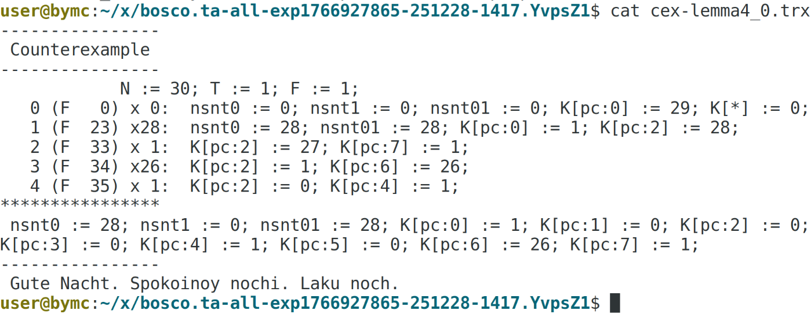

# TACO Artifact

Welcome to the TACO model checker artifact README.

## Artifact Details

**DOI artifact**: [https://doi.org/10.5281/zenodo.18233866](https://doi.org/10.5281/zenodo.18233866)

**Paper**: "TACO: A Toolsuite for the Verification of Threshold Automata"

**Tested on**: amd64

Host OS:

- Ubuntu 22.04/24.04/25.04
- Fedora 42/43
- Container Runtime: Podman or Docker

Also tested on MacOS with arm64 running Podman, however for this setup we
observed significantly decreased performance especially for the tool we compare
against ([ByMC]).

### System Requirements

We provide both our tool and the tool we compare against ([ByMC]) in the form of a
Docker/container image.

> **TLDR**
>
> Minimal requirements: amd64 (x86) based system, with at least 32GB of memory;
> Docker (or alternative container runtime installed)
>
> Extended evaluation: multiple machines recommended

TACO does not have any special system requirements. However, we did not attempt
to build the tool we compare against [ByMC] for an architecture other than x86,
as the tool is no longer maintained.

The evaluation as presented in the main section of the paper took in sum 14h
(including around 2.5h for a run of ByMC).

Please be aware that the extended evaluation can take significant time, on our
setup, all runs took in sum 90h. Therefore, having access to multiple machines
might be beneficial.

However, you can decrease the runtime and resource consumption drastically. By
reducing the timeout per benchmark, e.g., reducing per benchmark to <= 10min,
you can limit the overall time and resource consumption such that a considerable
subset of benchmarks should be solvable by TACO on a decently powerful laptop
within 8h.

We will explain how to configure the timeout in the relevant sections.

## Introduction

This document will only provide you with instructions on how to reproduce the
benchmark results and instructions on how to access the TACO documentation.

The TACO documentation contains more information on how to model and verify
systems and protocols using TACO, as well as all the configuration options.
Additionally, the developer documentation contains details on the internals of
TACO. See [Section `Documentation`](#documentation) for how to access the
documentation.

## Reproducing the Benchmark Table

This section describes how to reproduce the benchmark results for all the TACO
model checkers.

### Preparation

First, you need to load the container image from the files of the artifact. This
can be done by navigating into the unzipped directory of the artifact and
executing

```bash
docker load -i taco.tar
```

This will load the image `localhost/taco:latest` onto your machine. Now you can
start a container and open a shell in the container using

```bash
docker run --rm -it localhost/taco:latest
```

<details> <summary><b>Details</b></summary>

- `--rm` specifies that the container will be deleted once you exit the
  shell, and
- `-it` starts the container in "interactive" mode, i.e., it opens the
shell for you.
</details>

Now you can already start executing benchmarks as described in sections
[`Smoke Tests`](#smoke-tests) and
[`Main Evaluation Benchmark Run`](#main-evaluation-benchmark-run).
However, the log files of such a test run will not be moved outside the
container and therefore will be gone as soon as the container terminates.

##### Mounting Local Storage to Obtain Results

While the previously described is sufficient for running the tests, you might
want the result tables and logfiles to be moved outside the container to
inspect them later.

This can be achieved by mounting your local storage into the container using
the `-v` flag. For example, use:

```bash
docker run --rm -it -v ./:/storage localhost/taco:latest
```

<details> <summary><b>Details</b></summary>
Here, `-v ./:/storage` specifies to mount the current directory, i.e., `./` to 
the container and makes it accessible in the running container under the 
directory `/storage`.

If your machine has SELinux configured, you might have to append the `:z` see
option; This however should never be done in the directory `/home` or `/usr`.

See [Docker Documentation](https://docs.docker.com/engine/storage/bind-mounts/#configure-the-selinux-label)

</details>

If the directory `/storage` exists, the benchmark scripts will automatically
move the result table(s), logfile(s) and potential crash reports to your local
storage after all benchmarks are finished.

### Smoke Tests

As mentioned before, a full benchmark run can take more than 14h (or 90h
respectively). Therefore, we include a set of smoke tests to first verify that
TACO is running without issues.

In the shell of the TACO container, you can execute the smoke tests simply by
running:

```bash
benchmark-taco --smoke
```

The smoke tests will execute the benchmark set "Small ByMC" with a timeout of
30s for each model checker. Additionally, this setting will print all the output
of TACO to the console to make any errors that might occur directly visible.

The script will also create a preliminary result table called `taco-exec.csv`
which should roughly match the results we reported in our paper for these
benchmarks.

### Main Evaluation Benchmark Run

To run the set of benchmarks used for the experimental evaluation in the
main section of the paper with a timeout of 20min per benchmark you can simply
start the TACO benchmark script by running:

```bash
benchmark-taco
```

This will run the full benchmark suite with a timeout of 20min per benchmark.
Note that in sum such a run can take around 11.5h.
The [next section](#setting-a-different-timeout) will describe the flags to set
a different timeout per benchmark.

The benchmark script will then only report time and memory statistics per
benchmark (and errors in case any occurred). This output will also be parsed
into a CSV table named `taco-exec.csv`. This table should match the results
reported in the paper.
The model checker output will be written to a separate log file
(`taco-exec.log`). Both files will be moved to your local storage in case you
mounted it to the container (see section [Preparation](#preparation)).

#### Setting a Custom Timeout

For example to set a timeout of 10min per benchmark, use

```bash
benchmark-taco --timeout 10m
```

(The time must be specified in the input format of the `timeout` command, i.e.,
3s are specified as `3s`, 3min as `3m` and 3h as `3h`).

The above timeout of 10min per benchmark should be sufficient for all benchmarks
to be completed or timed out within 8h.

#### Running only a Single Model Checker

To run the full set of benchmarks for a single model checker, e.g., if you split
the benchmark run across multiple machines, you can simply pass the model
checker as a flag to the benchmark script.

For example, to only run the full set of benchmarks for the SMT model checker,
use:

```bash
benchmark-taco --smt
```

#### Other options

If your environment has the need for more configuration, e.g., we include more
configuration options in the TACO benchmark script, which you can get an
explanation for by running

```bash
benchmark-taco --help
```

#### Extended Evaluation Benchmark Run

To run the set of benchmarks used for the extended experimental evaluation in
the appendix of the paper with a timeout of 20min per benchmark, you can add the
`--extended` flag when starting the TACO benchmark script:

```bash
benchmark-taco --extended
```

This flag will execute the complete set of benchmarks **with only one SMT
solver**. By default this will be [Z3]. To obtain the results with `cvc5` as
SMT solver, you need to start an additional run and additionally set the
`--smt-solver` flag set to `cvc5`:

```bash
benchmark-taco --extended --smt-solver cvc5
```

### ByMC

Since [ByMC] has not been maintained for a few
years now, compiling it requires installation of old versions of dependencies.
Unfortunately, this also includes components that TACO uses, like Z3.
Therefore we needed to package ByMC into a separate container image.

We made the Dockerfile which we used to compile ByMC openly available on GitHub
in the form of this [pull request](https://github.com/konnov/bymc/pull/2).
We built the image included in this artifact from the same Dockerfile, only
adding additional steps to include the benchmark files and a convenient
benchmark script.

> **Note**
>
> You can find more details on why we chose to create a custom Dockerfile
> in section [Container Image vs ByMC VM](#container-image-vs-bymc-vm).

Similar to the TACO image before, we first need to load the container image
using

```bash
docker load -i bymc.tar
```

which will load the image `localhost/bymc:latest` onto your machine. Now you can
start a container and open a shell using this image using

```bash
docker run --rm -it localhost/bymc:latest
```

or again with

```bash
docker run --rm -it -v ./:/storage localhost/bymc:latest
```

If you want the logfiles to be moved to your local storage outside the
container.

Analog to the TACO benchmarks, you can execute the set of benchmarks used in
the evaluation section in the main part of the paper by
running:

```bash
benchmark-bymc
```

This will start ByMC in the default (`popl17`) mode with the same timeout of
20min. A full benchmark run in this case took us around 8h. Again, you can lower
the timeout by using the `--timeout` flag. For example:

```bash
benchmark-bymc --timeout 10m
```

will set a benchmark to timeout after 10min.

Analog to the TACO benchmark script, the script will only report benchmark
execution time and resource consumption and will store the benchmark results in
`bymc-exec.csv` and the model checker output as a logfile called
`bymc-exec.log`. ByMC additionally stores counter examples in the `x` directory.

#### Extended Evaluation Benchmark Run

Analog to the TACO benchmark script, you can start an extended evaluation run
using the `--extended` flag:

```bash
benchmark-bymc --extended
```

In this case, the script will directly also run ByMC in the `cav15` mode.

## Documentation

The TACO documentation consists of two parts

- the user documentation, and
- the developer documentation

The developer documentation uses the standard
[Rust Doc comment](https://doc.rust-lang.org/rust-by-example/meta/doc.html)
syntax to document the interfaces of the different components of TACO.

The user documentation is generated using
[`MyST Markdown`](https://mystmd.org/) from the files in the `./docs`.

There are multiple ways to access the documentation:

- Checkout TACO's website [`taco-mc.dev`](https://taco-mc.dev) (_easiest_)
- Serve the documentation from the container image
- Read the source files
- Build the documentation from scratch

The first option might already display an updated page as TACO is still actively
maintained. To get the documentation at the time of submission, you can serve
it from the provided container image by following the instructions in the next
section.

### Serving the Documentation from the Container

To be able to access the documentation server that will be running inside the
TACO container, we need to publish the port `80` (which will be the port of our
server will be serving the documentation) of the container by additionally using
the `--publish` flag.

```
docker run --rm -it --publish 3000:80 localhost/taco
```

This command will start a shell in the container while also mapping the port
`80` of the container to port `3000` of the host.

<details> <summary><b>In Case of Errors</b></summary>
IT might happen that you get an error of the form

```bash
Failed to bind port 3000 (Address already in use)
```

In this case, a different application is already using the port `3000` on your
local machine and you can just use a different port, e.g., `3001` when starting
the container.

The documentation will in then case be served under the address
[http://localhost:3001](http://localhost:3001).

</details>

You can now start the
documentation server by executing (and leaving the shell open)

```bash
serve-docs
```

and you should now be able to open
[http://localhost:3000](http://localhost:3000) and will be served the TACO
documentation.

Internally, the `serve-docs` command simply starts
[`Apache2`](https://httpd.apache.org/) which serves the static HTML file under
`/var/html/www`.

### Source Files

The user documentation is generated from the LaTeX and Markdown that are located
in the `src/docs` directory both formats are (more or less) human-readable.
Additionally, the developer documentation is part of the source code files.

### Building the Documentation from Sources

You can also build the documentation yourself. However, this will require
`cargo` to be installed on your machine to build the developer documentation
and [MyST](https://mystmd.org/guide/quickstart) for the user documentation.

You can find more information and instructions for building the documentation
in the file `src/docs/dev-docs.md` in the sections
`Building the Developer Documentation` and
`Displaying & Editing the User Documentation`.

## Additional Contents of the Artifact

We have included the full source code of TACO inside this artifact in the `src`
directory. Alternatively, you can also find the source code in [TACO's Github
repository](https://github.com/cispa/TACO).

You will also be able to find the Dockerfiles, scripts, documentation, etc. in
the `src` directory.

### Running TACO

If you want to test out the TACO CLI in the image we provided, you can call TACO
by simply using

```bash
taco-cli
```

as TACO has been correctly installed in the container image.

## Benchmarking Considerations

This section will elaborate on some choices that were made when designing the
outlined benchmarking process for this artifact evaluation.

### Metrics & Limits during Evaluation

The benchmarking scripts always report the elapsed real-time and maximal
resident set size as reported by the GNU `time` command.

Additionally, we use the `timeout` command to stop benchmark runs that exceed
the maximal runtime. In our evaluation we set the timeout to 20min.

The memory limit was set using `ulimit -SHv`, i.e., we limited the memory
consumption by setting a limit on the virtual memory the model checkers are
allowed to use. For the evaluation the limit was set to `2071552`MB.

We conducted our evaluation on Dell R6525 nodes equipped with 2x AMD Epyc 7773x
with 128 physical cores + 128 Simultaneous Multithreading and 2TB of RAM.
All nodes were part of [SLURM](https://slurm.schedmd.com/documentation.html)
cluster that uses [ENROOT](https://github.com/NVIDIA/enroot) as the container
runtime and Ubuntu 24.04 as the node host OS. For the evaluation, a node was
always allocated exclusively to ensure no other workloads were running on the
node.

### Origin of the Benchmarks

The benchmarks have been taken/generated from the
[`fault-tolerant-benchmarks`](https://github.com/konnov/fault-tolerant-benchmarks)
repository.

You can find more information about the generation of these benchmarks, and
about why some of them have been excluded in the `README` of the
`src/benchmarks` directory.

### Container Image vs. ByMC VM

Note that instead of using our Dockerimage for [ByMC], we could have also used
the VM that is still available (see the README of the
[ByMC repo section installation](https://github.com/konnov/bymc?tab=readme-ov-file#installation)).

There were two main reasons why we chose to build our own Dockerfile instead:

- Cumbersome benchmark process. The ByMC VM is based on Debian 9 and by now is
  difficult to work with. For example, in our testing the guest additions
  (providing functionality like shared folders, drag and drop) did not work
  properly, making file transfer difficult. We would have not been able to
  provide the reviewers with the same level of automation as with the current
  container-based method.
- Even older dependencies. The VM comes, for example, with [Z3] `4.4.1` (released
  Oct 5th 2015 on
  [GitHub](https://github.com/Z3Prover/z3/releases/tag/z3-4.4.1)) installed
  which is three years older than the version of [Z3] we were able to use in
  the container image, which is `4.7.1` (released May 23rd 2018 on
  [GitHub](https://github.com/Z3Prover/z3/releases/tag/z3-4.7.1)).
  In general we attempted to include the most recent version for which the
  build of ByMC would succeed without modification to the source code.
  Our goal here was to attempt to reduce the impact of optimizations to external
  components (like SMT solvers).
  Still, [ByMC] is a no longer maintained tool, so we did not attempt more
  significant changes to the build process (like migrating away from the legacy
  build system [`ocamlbuild`](https://github.com/ocaml/ocamlbuild)) or modifying
  the source code, as we would expect users to go through this process.

### Exclusion of the CAV15 Method

We did exclude the benchmark mode `cav15` of ByMC in the main benchmark
evaluation. This is because we had major issues with this mode. For example, for
the benchmarks in the folder `isola18/ta-(handcoded)` for

- `bosco.ta`
- `c1cs.ta`
- `cf1s.ta`

this mode reported the benchmarks to be unsafe, even though all other model
checkers (including ByMC in the `isola18` mode) report them as save.

Here is an example of the counter example ByMC reports for `bosco.ta`:

```
----------------
 Counterexample
----------------
            N := 4; T := 1; F := 1;
   0 (F   0) x 0:  nsnt0 := 0; nsnt1 := 0; nsnt01 := 0; K[pc:0] := 3; K[*] := 0;
   1 (F  13) x 3:  nsnt0 := 3; nsnt01 := 3; K[pc:0] := 0; K[pc:2] := 3;
   2 (F  31) x 1:  K[pc:2] := 2; K[pc:6] := 1;
   3 (F  33) x 1:  K[pc:2] := 1; K[pc:7] := 1;
   4 (F  35) x 1:  K[pc:2] := 0; K[pc:4] := 1;
****************
 nsnt0 := 3; nsnt1 := 0; nsnt01 := 3; K[pc:0] := 0; K[pc:1] := 0; K[pc:2] := 0; K[pc:3] := 0; K[pc:4] := 1; K[pc:5] := 0; K[pc:6] := 1; K[pc:7] := 1;
----------------
 Gute Nacht. Spokoinoy nochi. Laku noch.
```

This counter example should represent a counter example to the property

```
lemma4_0: []((locD0 != 0) -> (locU1 == 0));
```

i.e. this should be a run that satisfies the negation, i.e.:

```
<>((locD0 != 0)  && (locU1 != 0))
```

analyze the example. Configuration `1` has the variable state
`nsnt0 := 3; nsnt01 := 3;`.
The only rule incrementing `nsnt0` and `nsnt01` as in
configuration 1 is:

```
/* send message 0 (resp. 1) when initialized with value 1 (resp. 1) */
0: loc0 -> locS0
    when (true)
    do { nsnt0' == nsnt0 + 1; nsnt1' == nsnt1; nsnt01' == nsnt01 + 1; };
```

i.e., three processes must start in `loc0` and must have transitioned to
`locS0`. By the initial condition `(loc0 + loc1) == N - F` these are all
processes appearing in the run.

Therefore, in configuration `1` only `locS0` contains processes. From
`locS0` there is only one possibility to reach `locU1` is by some process
executing rule `6`:

```
 6: locS0 -> locU1 /* underlying consensus 1 */
      when ((nsnt01 >= N - T - F)
                && (2 * nsnt0 < N + 3 * T + 1)
                && (2 * nsnt1 < N + 3 * T + 1)
                && (2 * nsnt0 < N - T + 1)
                && (2 * nsnt1 >= N - T + 1 - 2 * F))
      do { unchanged(nsnt0, nsnt1, nsnt01); };
```

Substituting with the parameter assignment of the counter example `N := 4; 
T := 1; F := 1;`:

```
 6: locS0 -> locU1 /* underlying consensus 1 */
      when ((nsnt01 >= 2)
                && (2 * nsnt0 < 8)
                && (2 * nsnt1 < 8)
                && (2 * nsnt0 < 4)
                && (2 * nsnt1 >= 2))
      do { unchanged(nsnt0, nsnt1, nsnt01); };
```

i.e., `nsnt1` must be at least 2 which is currently not the case. The only rule
that increments `nsnt1` is:

```
1: loc1 -> locS1
    when (true)
    do { nsnt0' == nsnt0; nsnt1' == nsnt1 + 1; nsnt01' == nsnt01 + 1; };
```

Therefore, either

- some processes must have started in `loc1`, which is not the case, as
  explained before.
- or some processes must be able to reach `loc1`, which is impossible as `loc1`
  has no incoming rules.

Therefore no process can transition to `locU1` and the counter example is
invalid.

We saw this behavior in the official ByMC VM
(see [Screenshot ByMC Counter Example `bosco`](#screenshot-bymc-counter-example-bosco))
as well as with ByMC built with our provided Dockerfile. As this raises
questions about the overall correctness of the current implementation of this
method we decided not to include results of this mode in our main comparison.
For completeness, we still reported performance results in the extended
evaluation in the appendix of our paper.

#### Screenshot ByMC Counter Example `bosco`



[ByMC]: https://github.com/konnov/bymc
[CVC5]: https://cvc5.github.io/
[Z3]: https://github.com/Z3Prover/z3
